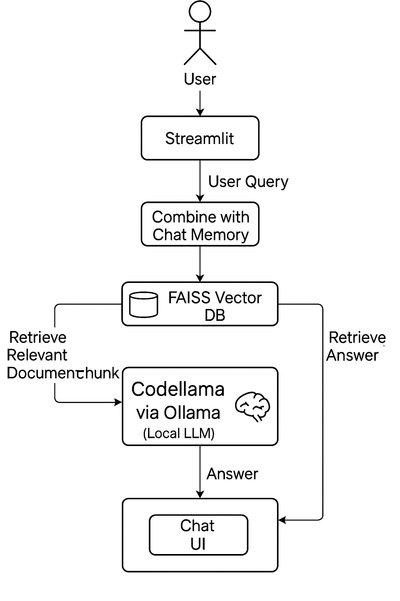

```markdown
# 📚 RAG Chatbot with Ollama + LangChain

A local Retrieval-Augmented Generation (RAG) chatbot that can answer questions from your own documents using a local LLM. Powered by [Ollama](https://ollama.com), [LangChain](https://www.langchain.com/), [FAISS](https://github.com/facebookresearch/faiss), and `codellama-7b`.

---

## 🚀 Features

- ✅ Chat with your own `.txt`, `.pdf`, and `.docx` files
- ✅ Uses **codellama-7b** (or any Ollama model) locally
- ✅ Clean chat UI with history using **Streamlit**
- ✅ Context-aware recursive questions
- ✅ Simple folder-based document loading
- ✅ Fast search using **FAISS** + MiniLM embeddings

---

## 🖼️ Architecture Diagram

> This is how the chatbot works internally:



---

## 📁 Folder Structure

```
rag-chatbot/
├── rag_chatbot.py         # Streamlit chatbot app
├── my_docs/               # Place your documents here
├── requirements.txt       # Python dependencies
├── architecture.png       # Architecture image
└── README.md              # This file
```

---

## ⚙️ Getting Started

### 1. Clone this repository

```bash
git clone https://github.com/yourusername/rag-chatbot.git
cd rag-chatbot
```

### 2. Install dependencies

```bash
pip install -r requirements.txt
```

If `requirements.txt` is missing, manually install:

```bash
pip install streamlit langchain faiss-cpu sentence-transformers \
    langchain-community python-docx unstructured[all] pdfminer.six
```

### 3. Pull & start your model with Ollama

```bash
ollama pull codellama:7b
```

Ollama should be running in the background:

```bash
ollama run codellama:7b
```

> You can swap `codellama:7b` with other models like `mistral`, `llama3`, or your own fine-tuned one.

### 4. Run the chatbot

```bash
streamlit run rag_chatbot.py
```

Open your browser at: [http://localhost:8501](http://localhost:8501)

---

## 🧠 How It Works

1. Loads documents from a folder
2. Splits them into chunks
3. Embeds them with `MiniLM` using `sentence-transformers`
4. Stores them in FAISS (vector database)
5. When you ask a question:
   - LangChain retrieves the most relevant chunks
   - The query + context are sent to Ollama (`codellama`)
   - The model answers, and the answer is shown in Streamlit

---

## ✍️ Example Questions

- "How do I read a CSV file using pandas?"
- "Summarize the company policy."
- "What are the key points from the PDF I uploaded?"

---

## 🧰 requirements.txt

```
streamlit
langchain
langchain-community
faiss-cpu
sentence-transformers
python-docx
pdfminer.six
unstructured[all]
```

Save this in a `requirements.txt` file for easy setup!

---

## 📌 Future Ideas

- [ ] File upload from UI
- [ ] Multi-user support
- [ ] Memory & context chaining
- [ ] Real chat bubble-style UI
- [ ] Model switcher in the sidebar

---

## 📝 License

MIT — free to use, modify, and share.

---

## 🙌 Acknowledgements

- [LangChain](https://www.langchain.com/)
- [Ollama](https://ollama.com)
- [FAISS](https://github.com/facebookresearch/faiss)
- [Streamlit](https://streamlit.io)
```

